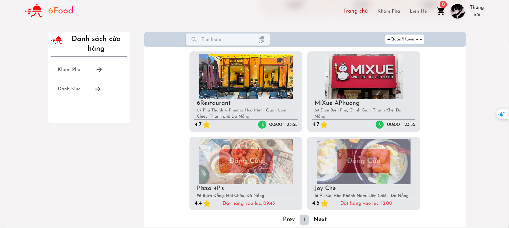

# Food Delivery App - React

## Introduction

This is a Food Delivery application built with React, aiming to provide a convenient and fast online food ordering experience.

# Installation

## Requirements

- Node.js: Version 14.0 or above
- Yarn: Package manager for Node.js projects

## Step 1: Clone the Source Code

git clone https://github.com/ThaiNguyen1710/PBL6-Food_delivery.git
cd folder

## Step 2: Install Dependencies

yarn add

# Usage

## Development Server

To start the development server, run the following command:

yarn start

This will launch the app in development mode. Open http://localhost:3000 in your browser to view it.

# Production Build

To build the app for production, use the following command:

npm run build
This will create a build folder with optimized and minified production-ready files.

# Features

- User Authentication: Allow users to sign up, log in, and manage their accounts.
- Browse Restaurants: Explore a list of available restaurants with details and menus.
- Order Placement: Select items from the menu and place orders securely.
- Order Tracking: Track the status of orders in real-time.

# Technologies Used

- React: JavaScript library for building user interfaces
- Redux: State management for React applications
- MongoDB: Backend as a Service for authentication and data storage

# License

This project is licensed under the MIT License - see the LICENSE file for details.

# Result Paste Section

